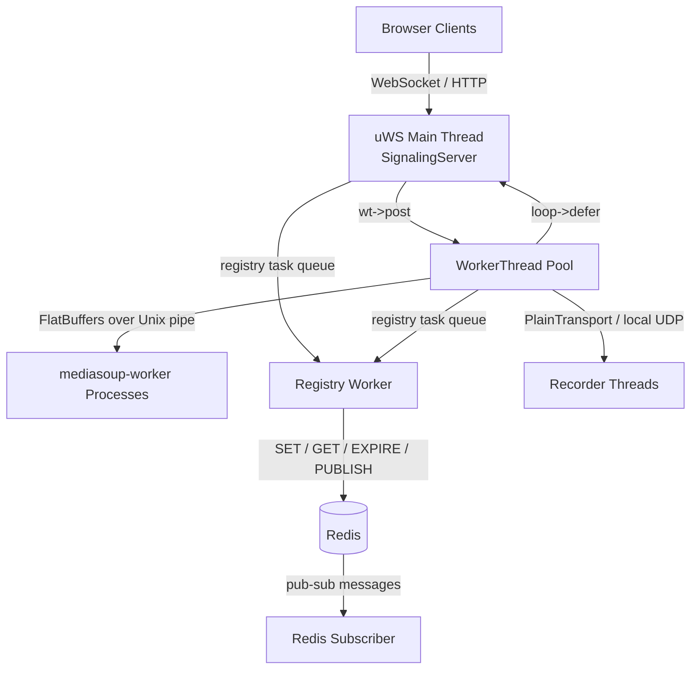
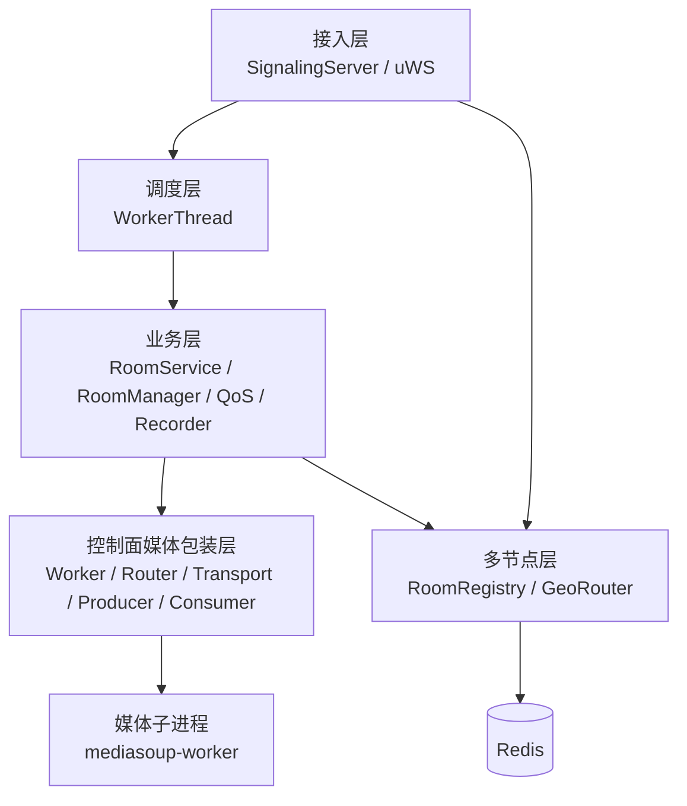
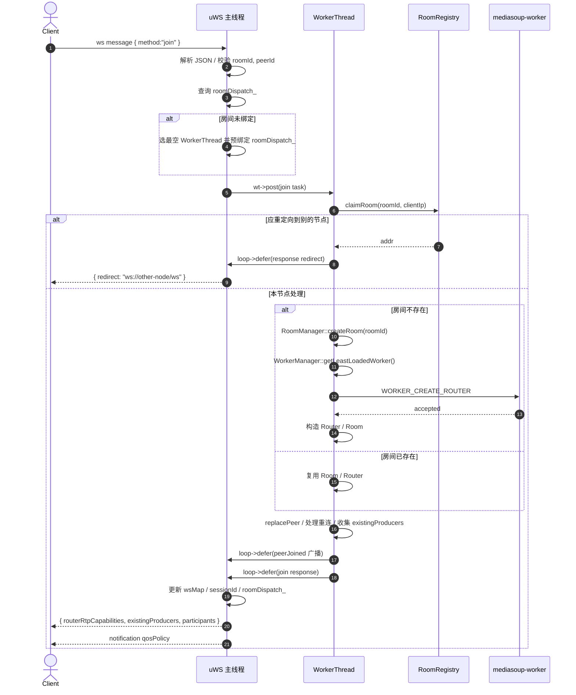
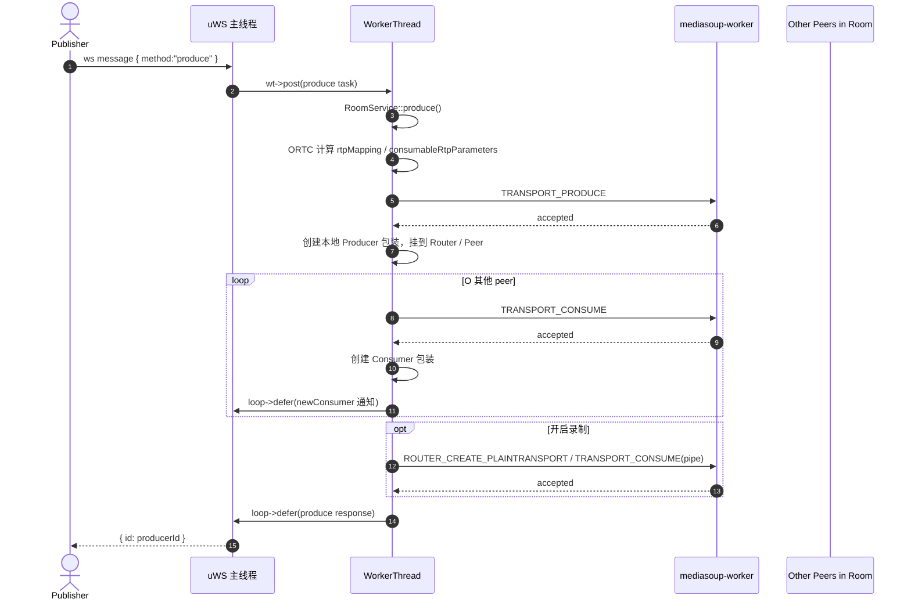

# mediasoup-cpp 架构文档

本文档是控制面架构的具体说明，重点回答下面几个问题：

- 这个进程里到底有哪些线程和子进程
- `uWS` 主线程、`WorkerThread`、`mediasoup-worker` 分别负责什么
- 一个请求从 WebSocket 进入后，在哪些地方发生线程切换、进程 IPC、Redis 访问
- 房间、多节点、QoS、录制、故障恢复分别挂在哪条链路上
- 仓库内 Linux `PlainTransport C++ client` 这条补充路径如何接入同一套房间 / QoS 体系

如果只需要构建、测试和常规开发入口，先读 [DEVELOPMENT.md](./DEVELOPMENT.md)。如果需要理解运行时控制流、所有权和时序，再读本文。
如果需要专门看 Linux client，请继续看 [linux-client-architecture_cn.md](./linux-client-architecture_cn.md)。

## 1. 设计结论

这个项目的核心设计不是“多线程共享房间状态”，而是“房间归属到单个 `WorkerThread`，所有房间业务串行执行”。

运行时可以拆成两层：

- 控制面：当前这个 C++ 进程，负责 WebSocket/HTTP、房间状态、路由决策、录制和 QoS 聚合
- 媒体面：外部 `mediasoup-worker` 子进程，负责 Router/Transport/Producer/Consumer 和 RTP 转发

控制面内部再分成三类执行单元：

- `uWS` 主线程：网络接入、HTTP、WebSocket、定时器、房间到线程的分发
- `WorkerThread` 池：串行执行 `RoomService`，并驱动和 `mediasoup-worker` 的 IPC
- Redis 后台线程：一个 fire-and-forget registry worker，加一个 subscriber 线程

## 2. 运行时拓扑



如果当前渲染器仍然不支持 Mermaid，可以直接按下面的纯文本拓扑理解：

```text
Browser Clients
    |
    | WebSocket / HTTP
    v
uWS Main Thread (SignalingServer)
    | \
    |  \ registry task queue
    |   \
    |    v
    |  Registry Worker ---------> Redis
    |                                |
    |                                | pub-sub
    |                                v
    |                          Redis Subscriber
    |
    | wt->post
    v
WorkerThread Pool
    | \
    |  \ FlatBuffers over Unix pipe
    |   \
    |    v
    |  mediasoup-worker Processes
    |
    | PlainTransport / local UDP
    v
Recorder Threads

WorkerThread Pool -- loop->defer --> uWS Main Thread
```

## 3. 线程与进程模型

| 执行单元 | 数量 | 阻塞原语 | 主要职责 |
|---|---:|---|---|
| `uWS` 主线程 | 1 | `uWS::Loop` / epoll | WebSocket 收发、HTTP、定时器、`roomDispatch_`、回主线程 `defer` |
| `WorkerThread` | N | `epoll_wait` | 串行执行 `RoomService`、task queue、Channel IPC、health/GC |
| Registry worker | 1 | `condition_variable::wait` | `refreshRoom`、`unregisterRoom`、heartbeat、load update |
| Redis subscriber | 1 | `poll` + `redisGetReply` | 监听 node/room 更新，刷新本地缓存 |
| mediasoup worker waiter | threaded 模式才有 | `waitpid` | 当前架构默认不用 |
| Recorder thread | 每个活动录制 peer 1 个 | `recv` | 接收本地 UDP RTP，写 WebM/QoS 侧文件 |
| `mediasoup-worker` 子进程 | M | 子进程事件循环 | 真正的 Router/Transport/Producer/Consumer 媒体逻辑 |

当前架构的关键点：

1. `WorkerThread` 创建 `Worker(..., threaded=false)`，不使用每个 `Channel` 自带的读线程。
2. `Channel` 的 consumer fd 统一注册到 `WorkerThread` 的 epoll，由 `WorkerThread` 在同一个事件循环里驱动 mediasoup IPC。
3. `uWS` socket 只能在所属 loop 线程使用，所以跨线程回复必须走 `loop->defer(...)`。

## 4. 核心对象与所有权

### 4.1 主线程拥有的状态

- `SignalingServer`
- `roomDispatch_`: `roomId -> WorkerThread*`
- `destroyedRooms_`
- `WsMap`: `roomId/peerId -> ws*` 与 `roomId -> socket set`
- `uWS` timers: stats、Redis heartbeat、shutdown poll

这些状态约定只在 `uWS` 主线程访问，所以 `roomDispatch_` 不加锁。

### 4.2 WorkerThread 拥有的状态

每个 `WorkerThread` 独占：

- `WorkerManager`
- `RoomManager`
- `RoomService`
- 一个 task queue
- 若干 `Worker` 包装对象
- 这些 `Worker` 对应的 `Channel` consumer fd
- health / GC timerfd

房间业务逻辑的真实所有权边界是：

- `RoomService`
- `RoomManager`
- `Room`
- `Peer`
- `Router`
- `Transport`
- `Producer`
- `Consumer`

它们逻辑上都应当只在所属 `WorkerThread` 中操作。

注意：

- `Room` 和 `RoomManager` 内部仍有互斥锁，它们更多是局部防御，不是“允许跨线程自由访问”的信号。
- 设计目标仍然是“同一个房间的业务状态只在一个 `WorkerThread` 上推进”。

### 4.3 子进程拥有的状态

`mediasoup-worker` 进程里拥有真正的媒体对象：

- Router
- WebRtcTransport / PlainTransport / PipeTransport
- Producer / Consumer
- RTP observer 等

控制面只保存这些对象的 C++ 包装和必要的本地派生状态。

### 4.4 模块分层与依赖方向

从依赖方向上，这个项目大致是五层：



依赖规则可以概括成：

- `SignalingServer` 可以依赖 `WorkerThread` 和 `RoomRegistry`，但不直接做 mediasoup IPC
- `RoomService` 负责业务决策，但不直接碰 `uWS` socket
- `Router` / `Transport` / `Producer` / `Consumer` 是“控制面媒体包装层”，专门把业务调用翻译成 `Channel` IPC
- `Channel` 以下不要反向依赖 `RoomService`
- Redis 相关逻辑收敛在 `RoomRegistry`，不要把 Redis I/O 散落进业务层

最容易失控的坏味道是：

- 在 `SignalingServer` 里直接加业务分支，绕开 `RoomService`
- 在 `RoomService` 里直接碰 WebSocket 或 loop 细节
- 在 `RoomRegistry` 之外新增随手 Redis 访问
- 在 `WorkerThread` 之外做 non-threaded `Channel` IPC

### 4.5 仓库内 Linux `PlainTransport C++ client`

这个仓库除了浏览器信令 / WebRTC 路径，还维护一条 Linux `PlainTransport C++ client` 路径：

- 薄入口：`client/main.cpp`
- shared orchestration / session bootstrap：`client/PlainClientApp.*`
- threaded / legacy runtime orchestration：`client/PlainClientThreaded.cpp`, `client/PlainClientLegacy.cpp`
- RTCP：`client/RtcpHandler.h`
- QoS：`client/qos/*`

它不属于服务端进程内部线程模型的一部分，但它是当前 `plainPublish`、`clientStats`、`qosPolicy`、`qosOverride`、`cpp-client-harness`、`cpp-client-matrix` 这些链路的重要一端。

从职责上看，它可以拆成 4 层：

1. `WsClient`
   - `join`
   - `plainPublish`
   - `clientStats`
   - `getStats`
   - 异步 response / notification 分发
2. FFmpeg / RTP 数据面
   - MP4 demux
   - H264 copy 或 `decode -> x264 re-encode`
   - Opus 音频转码
   - RTP packetize + UDP
3. RTCP
   - SR / RR
   - RTT / jitter
   - NACK / PLI / FIR
   - per-SSRC retransmission / keyframe cache
4. QoS runtime
   - 每 video track 一个 `PublisherQosController`
   - peer 内多 track budget 协调
   - `clientStats` snapshot 上报
   - `qosPolicy` / `qosOverride` 消费

当前主架构文档只保留这一层摘要；完整细节见 [linux-client-architecture_cn.md](./linux-client-architecture_cn.md)。

## 5. 跨线程与跨进程通信机制

### 5.1 主线程 -> WorkerThread：`wt->post(...)`

用途：

- 把房间请求从 `uWS` 主线程切到房间所属的 `WorkerThread`
- 把定时任务拆到 worker 线程执行

机制：

1. 调用方把 lambda 推进 `taskQueue_`
2. `post()` 往 `eventfd` 写入一个值
3. `WorkerThread` 的 epoll 被唤醒
4. `processTaskQueue()` 在 worker 线程里串行执行任务

这条链路是项目内自定义的“投递到业务线程”机制。

### 5.2 WorkerThread -> 主线程：`loop->defer(...)`

用途：

- 回主线程做 `ws->send()`
- 更新 `roomDispatch_`
- 回复异步 HTTP 请求

机制：

1. lambda 放入 `uWS::Loop` 的 defer queue
2. `uSockets` 用 async wakeup fd 唤醒 loop
3. loop 线程执行 wakeup callback，drain defer queue
4. 回调在主线程里运行

这条链路是 `uWS` 提供的“投递回网络事件循环线程”机制。

### 5.3 WorkerThread <-> mediasoup-worker：`Channel`

用途：

- 创建 Router / Transport / Producer / Consumer
- 获取 stats
- 接收 ICE/DTLS/score/producer pause 等通知

机制：

- 物理通道：两根 Unix pipe
- 编码：FlatBuffers size-prefixed message
- 请求侧：`requestBuildWait()` / `requestWait()`
- 响应匹配：`requestId -> promise`
- 通知侧：`Channel::emitter().emit(handlerId, ...)`

重要约束：

- non-threaded Channel 不能用 `request().get()`
- 当前架构必须由 `WorkerThread` 持续 pump consumer fd
- 所有 `requestWait()` 必须发生在 `WorkerThread` 上

### 5.4 任意线程 -> Registry worker

用途：

- `refreshRoom`
- `unregisterRoom`
- `/api/resolve`
- heartbeat / node load update

机制：

- `enqueueRegistryTask()` 把任务放进 `registryTasks_`
- registry worker 线程用 `condition_variable` 被唤醒
- 串行执行 Redis 命令

### 5.5 Redis subscriber -> 本地缓存

用途：

- 接收其他节点发布的 node/room 更新

机制：

- subscriber 线程单独持有 subscribe 连接
- `poll` 等待 fd 可读
- `handlePubSubMessage()` 更新 `nodeCache_` / `roomCache_`

缓存保护：

- `cmdMutex_`: Redis 命令上下文
- `cacheMutex_`: 本地 cache

规则：

- 不在 `cacheMutex_` 内做 Redis I/O
- 先 Redis 获取结果，再一次性 swap/merge 到 cache

## 6. 启动与关闭序列

### 6.1 启动

```text
main()
  -> 解析 config / CLI
  -> 可选 daemonize
  -> 初始化 Logger
  -> 可选初始化 GeoRouter
  -> 尝试创建 RoomRegistry 并 start()
  -> 构造 WorkerThread pool
  -> 构造 SignalingServer
  -> server.run()
       -> startRegistryWorker()
       -> 给每个 WorkerThread 注入 notify/broadcast/roomLifecycle/registryTask/taskPoster
       -> wt->start()
       -> wt->waitReady()
       -> 确认至少有一个 mediasoup worker 可用
       -> uWS::App().listen()
```

启动 gating 很严格：

- 所有 `WorkerThread` 必须先 `waitReady()`
- 至少有一个 `mediasoup-worker` 成功创建
- 只有这样才开始对外 listen

### 6.2 关闭

```text
SIGINT/SIGTERM
  -> g_shutdown = true
  -> uWS shutdown timer 关闭 listen socket
  -> server.run() 返回
  -> 逐个 wt->stop()
       -> closeAllRooms()
       -> 产生 unregisterRoom 任务
  -> server.stopRegistryWorker()
       -> 排空剩余 registryTasks_
  -> registry->stop()
       -> DEL node key
       -> 发布节点下线消息
```

顺序不能反：

- 必须先停 `WorkerThread`
- 再停 registry worker

否则会丢掉房间注销任务。

## 7. 请求链路

### 7.1 `join`

`join` 有三条不同路径：

1. 房间应当在别的节点：返回 `redirect`
2. 房间已在本节点：纯主线程 + WorkerThread 内存路径
3. 房间首次在本节点创建：额外触发一次 `WORKER_CREATE_ROUTER`

#### 7.1.1 成功 join 的完整时序



几个关键事实：

- `join` 本身不创建 WebRtcTransport
- 新房间 `join` 只会对 `mediasoup-worker` 发一次 `WORKER_CREATE_ROUTER`
- `routerRtpCapabilities` 是控制面本地根据 codec 配置生成的，不是从 worker dump 出来的
- 旧连接替换发生在主线程 defer 回调里，旧 socket 会先 `alive=false` 再被踢下线

#### 7.1.2 `join` 的主调方法

- 主线程入口：`SignalingServer::run()` 里 `.ws(...).message`
- worker 业务：`RoomService::join`
- 房间创建：`RoomManager::createRoom`
- Router 创建：`Worker::createRouter`

### 7.2 `createWebRtcTransport`

这条链路一定会命中 `mediasoup-worker`：

```text
Client -> uWS 主线程
       -> WorkerThread
       -> RoomService::createTransport()
       -> room->router()->createWebRtcTransport()
       -> Channel.requestBuildWait(ROUTER_CREATE_WEBRTCTRANSPORT)
       -> mediasoup-worker
       -> 响应带回 ICE/DTLS 参数
       -> WorkerThread 组装 transport->toJson()
       -> loop->defer()
       -> 主线程 ws.send(response)
```

如果这是“接收方向 transport”，还会顺手为房间里已有 producer 自动建 consumer，并把这些 consumer 信息直接塞进返回值。

结论：

- `createTransport` 不只是建 transport
- 对于接收端，它还承担“补建已有订阅”的职责

### 7.3 `connectWebRtcTransport`

```text
Client DTLS 参数
  -> 主线程
  -> WorkerThread
  -> RoomService::connectTransport()
  -> WebRtcTransport::connect()
  -> WEBRTCTRANSPORT_CONNECT
  -> mediasoup-worker
  -> defer 回主线程响应
```

这一步主要是完成 DTLS 参数协商，控制面返回 `dtlsLocalRole=server`。

### 7.4 `produce`

`produce` 是控制面最重的一条业务链路之一：



这里有三层工作同时发生：

1. 向 `mediasoup-worker` 创建 Producer
2. 对房间里其他 peer 做 server-driven auto-subscribe
3. 如需录制，再为 recorder 创建 PlainTransport + pipe consumer

这也是为什么 `produce` 比 `join` 更像真正的“控制面主链路”。

### 7.5 `consume`

显式 `consume` 的路径比 `produce` 短：

```text
Client
  -> 主线程
  -> WorkerThread
  -> RoomService::consume()
  -> Transport::consume()
  -> ORTC 计算 consumerRtpParameters
  -> TRANSPORT_CONSUME
  -> mediasoup-worker
  -> 返回 consumer->toJson()
  -> defer 回主线程响应
```

显式 `consume` 和 auto-subscribe 的底层 IPC 是同一个 `TRANSPORT_CONSUME`，区别只在于谁触发、返回值回给谁。

### 7.6 `getStats` 与定时 stats broadcast

单个 `getStats`：

- 主线程分发到 `WorkerThread`
- `RoomService::collectPeerStats()` 串行调用 `transport/prod/cons->getStats()`
- 每个 stats 子调用都会命中 `mediasoup-worker`
- 对单 peer 还设置了总预算，避免 stats 把控制线程长期卡死

定时 broadcast：

```text
uWS 主线程 timer
  -> 对每个 WorkerThread 执行 wt->post(broadcastStats)
  -> WorkerThread 按 room 逐个 collect stats
  -> 每个房间完成后用 taskPoster_ 再投递下一个房间
  -> notify_/broadcast_ 经 defer 回主线程发送
```

这里已经做了一个重要降压动作：

- 不是一次性在一个长循环里把所有房间全扫完
- 而是借助 `taskPoster_` 分批回投给同一个 `WorkerThread`

### 7.7 哪些请求会真正打到 `mediasoup-worker`

| 请求 / 动作 | 是否一定命中 `mediasoup-worker` | 备注 |
|---|---|---|
| `join` | 否 | 只有“房间首次在本节点创建”时才会发 `WORKER_CREATE_ROUTER` |
| `createWebRtcTransport` | 是 | `ROUTER_CREATE_WEBRTCTRANSPORT` |
| `connectWebRtcTransport` | 是 | `WEBRTCTRANSPORT_CONNECT` |
| `produce` | 是 | `TRANSPORT_PRODUCE`，并可能连带多个 `TRANSPORT_CONSUME` |
| `consume` | 是 | `TRANSPORT_CONSUME` |
| `pauseProducer` / `resumeProducer` | 是 | `PRODUCER_PAUSE` / `PRODUCER_RESUME` |
| `restartIce` | 是 | `TRANSPORT_RESTART_ICE` |
| `clientStats` | 否 | 只更新控制面的 QoS 聚合状态 |
| `peerJoined` / `newConsumer` / `qosPolicy` 这类通知 | 否 | 只是控制面回主线程发信令 |

### 7.8 `plainPublish` 与 Linux client 补充路径

浏览器路径走的是 `createWebRtcTransport -> connectWebRtcTransport -> produce`。

Linux `PlainTransport C++ client` 走的是另一条链路：

```text
plain-client
  -> WebSocket join
  -> plainPublish(videoSsrcs, audioSsrc)
  -> RoomService::plainPublish()
  -> Router::createPlainTransport()
  -> Transport::produce() for N video tracks + 1 audio track
  -> 返回 {ip, port, videoTracks[], audioPt}
  -> client 建立 UDP socket
  -> 发送 comedia 探测 RTP
  -> 按 producerId / trackId / ssrc 建立本地 runtime
```

这条链路的几个关键差异：

- 服务端不做 WebRTC 协商
- 客户端自己维护 RTP / RTCP 状态
- `clientStats` 不是浏览器 `getStats()`，而是 `RTCP + 本地计数 + server getStats` 的组合
- `qosPolicy` / `qosOverride` 仍然通过同一个 WebSocket 通知通道进入

## 8. 多节点与 Redis 架构

`RoomRegistry` 解决两类问题：

- 房间归属：某个 `roomId` 应该由哪个节点承接
- 节点发现：目前有哪些节点、它们的负载和地理位置如何

### 8.1 Redis key 与 channel

- 房间 key: `sfu:room:<roomId>`
- 节点 key: `sfu:node:<nodeId>`
- pub/sub channel:
  - `sfu:ch:rooms`
  - `sfu:ch:nodes`

### 8.2 `claimRoom` 与 `resolveRoom`

`claimRoom(roomId, clientIp)`：

- 先看本地 `roomCache_`
- miss 才进 Redis
- 用 Lua `SET NX EX` 原子抢占房间归属
- 如果房间已被其他节点持有，返回对方地址

`resolveRoom(roomId, remoteIp)`：

- 先查本地 `roomCache_`
- miss 时查 Redis
- 如果房间根本不存在，则按 `nodeCache_` 选一个最合适的节点

选点策略结合：

- 节点负载
- 可用容量
- 国家隔离
- `GeoRouter` 的地理距离与 ISP 评分

### 8.3 两条后台线程

registry worker：

- 处理 `refreshRoom`
- 处理 `unregisterRoom`
- 处理 heartbeat
- 处理 `/api/resolve`

subscriber 线程：

- 维持一条独立 SUBSCRIBE 连接
- 收到房间/节点变更后更新本地缓存
- 断线重连后做一次 `syncAll()`

### 8.4 Redis 不可用时的降级

默认运行契约下不再做隐式降级。

如果 Redis 启动失败：

- 启动直接失败
- 进程不会继续对外提供默认多节点路由服务

如果 Redis 在运行中失联：

- `/readyz` 返回 `503`
- 新的 `join` / `/api/resolve` 等 room-registry 依赖路径显式失败

只有在显式设置 `redisRequired=false` 时：

- `registry_ == nullptr`
- 进程才允许进入 local-only 模式

## 9. QoS 与录制的侧链路

### 9.1 `clientStats`

`clientStats` 的特殊点在于它先在主线程做轻校验：

```text
Client -> 主线程
       -> 校验已加入房间 / session 有效 / QoS schema 合法
       -> wt->post(setClientStats)
       -> WorkerThread 聚合 QoS
       -> 可能触发 qosOverride / connectionQuality / roomQosState
       -> 这些通知再 defer 回主线程
```

这样做的目的是：

- 丢掉明显无效或 stale 的 stats
- 避免无意义请求进入 `WorkerThread`

当前响应语义再细化了一层：

- `ok=true` 不再表示“已经投递到 worker 队列”，而是表示 worker 已经处理完这次 stats 请求
- `data.stored=true` 表示 snapshot 已入库
- `data.stored=false` 且带 `reason` 表示请求本身处理成功，但 snapshot 被 registry 按 `stale-seq` / `stale-ts` 等原因忽略

`downlinkClientStats` 也采用同样的 store-result 语义，但它仍然只把 snapshot 入库变成同步可观测；`downlinkQos` planner 收敛依旧是异步的。

这条路径同时服务于两类 client：

- 浏览器 / JS client
- Linux `PlainTransport C++ client`

两者 payload schema 相同，但 stats 来源不同：

- 浏览器：`RTCPeerConnection.getStats()`
- Linux client：`RTCP RR + 本地 RTP 计数 + server getStats`

### 9.2 录制

录制不是直接从浏览器写文件，而是走一条本地 RTP 旁路：

```text
Producer
  -> RoomService::autoRecord()
  -> Router::createPlainTransport()
  -> PlainTransport.connect(127.0.0.1, recorderPort)
  -> TRANSPORT_CONSUME(pipe=true)
  -> 本地 UDP 发给 PeerRecorder 线程
  -> PeerRecorder 写 .webm / .qos.json
```

录制线程与房间控制线程隔离，避免磁盘写入和 RTP 收包拖慢 `WorkerThread`。

## 10. 故障恢复与一致性

### 10.1 reconnect 与 stale request

项目用两层机制避免旧连接污染新会话：

第一层：socket 级别

- 每个 socket 持有 `alive` 原子标记
- 旧连接被替换时先 `alive=false`
- 所有 deferred 回调发送前先检查 `alive`

第二层：业务会话级别

- `join` 成功后给 `Peer` 写入新的 `sessionId`
- 非 `join` 请求进入 `WorkerThread` 前会带上旧 `sessionId`
- worker 执行前再次比对 `peer->sessionId`
- 不匹配直接返回 `"remote login"`

这样即使旧请求已经排队到 `WorkerThread`，也不会把旧会话的操作落到新会话上。

### 10.2 worker crash

`WorkerThread` 持续监听每个 `Channel` fd：

- fd EOF / read error
- `processChannelData()` 返回 false
- `handleWorkerDeath()`
- `onWorkerDied()`

接下来会：

1. 从 `WorkerManager` 移除旧 worker
2. 尝试 respawn
3. 新 worker 的 consumer fd 重新注册进 epoll
4. 由定时 `checkRoomHealth()` 发现死 Router 对应的房间
5. 向房间内 peer 广播 `serverRestart`
6. 清理房间并从 registry 注销

respawn 有速率限制：

- 10 秒内最多 3 次

超限后该 `WorkerThread` 保留其余健康 worker，不再无休止重启坏 worker。

### 10.3 IPC 超时与关闭语义

#### 同步请求

`Channel::requestWait()`：

- threaded 模式：等 future
- non-threaded 模式：循环 `poll + processAvailableData`

当前架构使用 non-threaded 模式。

#### 关闭请求

`Producer::close()` / `Consumer::close()` 的 close 请求是 fire-and-forget：

- 发请求但不 `.get()`
- 避免关闭路径因为 worker 变慢而阻塞控制线程

## 11. 修改代码时必须守住的边界

1. `uWS` socket 不能在 `WorkerThread` 里直接操作，只能 `loop->defer(...)` 回主线程。
2. `Channel` non-threaded 模式下，不能把 IPC 调用放回主线程或 registry worker 执行。
3. `roomDispatch_` 只能在主线程访问。
4. `cacheMutex_` 内不能做 Redis I/O。
5. 新增会阻塞的后台逻辑，优先考虑是否应该进 registry worker 或独立 side thread，而不是塞进 `WorkerThread`。
6. 判断“请求是否会打到 mediasoup-worker”时，不要只看 `RoomService`，要继续跟到 `Router` / `Transport` / `WebRtcTransport` / `Producer` / `Consumer` 包装层。

## 12. 快速定位源码

| 关注点 | 入口文件 |
|---|---|
| 启动、参数、线程池、关闭顺序 | `src/main.cpp` + `src/MainBootstrap.*` + `src/RuntimeDaemon.*` |
| WebSocket/HTTP、room dispatch、session 保护、主线程定时器 | `src/SignalingServer.h` + `src/SignalingServerWs.*` + `src/SignalingServerHttp.*` + `src/SignalingServerRuntime.cpp` |
| worker 线程事件循环、task queue、epoll、respawn | `src/WorkerThread.{h,cpp}` |
| join/leave/createTransport/produce/consume/QoS/录制 | `src/RoomService.h` + `src/RoomService*.cpp` |
| 房间与 peer 容器 | `src/RoomManager.h`, `src/Peer.h` |
| Redis 多节点路由与缓存 | `src/RoomRegistry.{h,cpp}` |
| Worker 负载均衡 | `src/WorkerManager.h` |
| 子进程管理 | `src/Worker.*` |
| FlatBuffers pipe IPC | `src/Channel.*` |
| Router/Transport 层 IPC | `src/Router.*`, `src/Transport.*`, `src/WebRtcTransport.*` |
| Producer/Consumer 通知与 stats | `src/Producer.*`, `src/Consumer.*` |

## 13. 读图建议

如果你准备继续改这个项目，建议按下面顺序建立心智模型：

1. 先理解 `SignalingServer` 如何把请求分到 `WorkerThread`
2. 再理解 `WorkerThread` 如何一边跑 task queue、一边泵 `Channel`
3. 再看 `RoomService::join/createTransport/produce`
4. 然后看 `RoomRegistry` 的多节点和后台线程
5. 最后补 `QoS`、`Recorder`、stats broadcast 这些侧链路

如果你脑子里一直记住一句话，应该是：

> 主线程负责接入和分发，`WorkerThread` 负责串行业务，`mediasoup-worker` 负责媒体对象，跨边界靠 `post`、`defer` 和 `Channel`。

## 14. 函数级时序图

这一节不再只说“主线程 -> worker 线程 -> 子进程”，而是把主链路压到具体方法名。

### 14.1 `join` 的函数级调用链

```text
Client
  -> SignalingServer::run() / ws.message
     -> getWorkerThread() / pickLeastLoadedWorkerThread() / assignRoom()
     -> WorkerThread::post(lambda)

WorkerThread event loop
  -> WorkerThread::processTaskQueue()
     -> RoomService::join(roomId, peerId, displayName, rtpCapabilities, remoteIp)
        -> RoomRegistry::claimRoom()                # 如果启用 Redis
        -> RoomManager::getRoom()
        -> RoomManager::createRoom()                # 仅新房间
           -> WorkerManager::getLeastLoadedWorker()
           -> Worker::createRouter()
              -> Channel::requestBuildWait(WORKER_CREATE_ROUTER)
                 -> Channel::requestBuildWithId()
                 -> Channel::sendBytes()
                 -> mediasoup-worker
                 -> Channel::waitForResponse()
                 -> Channel::processAvailableData()
                 -> Channel::processMessage()
           -> Router::Router(...)
        -> Room::replacePeer()
        -> postRegistryTask(refreshRoom)            # 异步 Redis 续期
        -> broadcast_(peerJoined)                   # 实际上会 defer 回主线程
     -> loop->defer(join response)

uWS 主线程
  -> deferred lambda
     -> 更新 wsMap / sessionId / roomDispatch_
     -> ws->send(response)
     -> ws->send(qosPolicy)
```

看这条链时，建议重点盯住两个边界：

- `assignRoom()` 在主线程、dispatch 之前发生，保证同房间并发首 `join` 落到同一个 `WorkerThread`
- `WORKER_CREATE_ROUTER` 是 `join` 唯一可能触发的 mediasoup IPC，且只发生在“本机新房间”场景

### 14.2 `createWebRtcTransport` 的函数级调用链

```text
Client
  -> SignalingServer::run() / ws.message
     -> getWorkerThread(roomId, false)
     -> WorkerThread::post(lambda)

WorkerThread event loop
  -> WorkerThread::processTaskQueue()
     -> RoomService::createTransport(roomId, peerId, producing, consuming)
        -> RoomManager::getRoom()
        -> Room::getPeer()
        -> Router::createWebRtcTransport(opts)
           -> Channel::requestBuildWait(ROUTER_CREATE_WEBRTCTRANSPORT)
              -> mediasoup-worker
              -> Channel::processAvailableData()
           -> WebRtcTransport 对象落地到控制面
        -> peer->sendTransport / recvTransport = transport
        -> 如果是 recv transport:
           -> 遍历 room->getOtherPeers()
           -> peer->recvTransport->consume(...)
              -> Transport::consume()
              -> Channel::requestBuildWait(TRANSPORT_CONSUME)
              -> mediasoup-worker
     -> loop->defer(response)

uWS 主线程
  -> ws->send(createTransport response)
```

这条链路的关键点是：

- `createTransport` 阶段已经可能隐式创建多个 `Consumer`
- 所以“接收 transport 创建慢”不一定只是 transport 本身慢，也可能是自动补订阅导致的

### 14.3 `produce` 的函数级调用链

```text
Client
  -> SignalingServer::run() / ws.message
     -> WorkerThread::post(lambda)

WorkerThread event loop
  -> WorkerThread::processTaskQueue()
     -> RoomService::produce(roomId, peerId, transportId, kind, rtpParameters)
        -> RoomManager::getRoom()
        -> Room::getPeer()
        -> Peer::getTransport()
        -> Transport::produce(options)
           -> ortc::getProducerRtpParametersMapping()
           -> Channel::requestBuildWait(TRANSPORT_PRODUCE)
              -> mediasoup-worker
           -> ortc::getConsumableRtpParameters()
           -> Producer 包装对象落地
        -> Router::addProducer()
        -> peer->producers[producerId] = producer
        -> 遍历 room->getOtherPeers()
           -> other->recvTransport->consume(...)
              -> Transport::consume()
              -> Channel::requestBuildWait(TRANSPORT_CONSUME)
              -> mediasoup-worker
           -> notify_(newConsumer)                  # defer 回主线程发信令
        -> autoRecord(...)
           -> Router::createPlainTransport(...)
           -> PlainTransport::connect(127.0.0.1, port)
           -> PlainTransport::consume(pipe=true)
              -> Transport::consume()
              -> Channel::requestBuildWait(TRANSPORT_CONSUME)
              -> mediasoup-worker
     -> loop->defer(produce response)

uWS 主线程
  -> ws->send(produce response)
  -> ws->send(newConsumer) to other peers
```

这条链最适合用来判断性能瓶颈：

- 如果 `produce` 慢，先区分是 `TRANSPORT_PRODUCE` 慢，还是 auto-subscribe 的多个 `TRANSPORT_CONSUME` 慢
- 如果房间里 peer 多，`produce` 的控制面复杂度会高于 `join`
- 如果录制打开，还要额外算上 PlainTransport 和 pipe consumer 的开销

### 14.4 `clientStats` 的函数级调用链

```text
Client
  -> SignalingServer::run() / ws.message
     -> 主线程校验 joined session / wsMap / qos schema
     -> WorkerThread::post(lambda)

WorkerThread event loop
  -> WorkerThread::processTaskQueue()
     -> RoomService::setClientStats(roomId, peerId, stats)
        -> QosValidator::ParseClientSnapshot()
        -> qosRegistry_.Upsert()
        -> QosAggregator::Aggregate()
        -> maybeNotifyConnectionQuality()
        -> maybeSendAutomaticQosOverride()
        -> maybeBroadcastRoomQosState()
     -> 这些 notify/broadcast 最终 defer 回主线程
```

这条链完全不打到 `mediasoup-worker`。如果你在排查 QoS 控制问题，先别急着看 `Transport` / `Producer` / `Consumer`。

## 15. 新人速读版

如果你刚接手这个项目，最实用的不是把所有代码一次看完，而是先知道“你改哪类问题时该从哪里下手”。

### 15.1 按问题类型定位

| 你要改的东西 | 第一入口 | 第二入口 | 最后才看 |
|---|---|---|---|
| WebSocket 协议、请求分发、session/reconnect | `SignalingServer.h` / `SignalingServerWs.cpp` | `WorkerThread.{h,cpp}` | `RoomService.h` |
| join/leave/房间生命周期 | `RoomServiceLifecycle.cpp` | `RoomManager.h` | `Worker.cpp` |
| transport / produce / consume | `RoomServiceMedia.cpp` | `Router.cpp`, `Transport.cpp`, `WebRtcTransport.cpp` | `Channel.cpp` |
| mediasoup IPC 超时 / 死锁 / 通知丢失 | `Channel.cpp` | `WorkerThread.{h,cpp}` | `Worker.cpp` |
| 多节点路由 / Redis 缓存 | `RoomRegistry.{h,cpp}` | `SignalingServerRuntime.cpp` 的 registry worker | `GeoRouter.*` |
| QoS 聚合 / override / policy | `RoomServiceQos.cpp` | `src/qos/*` | 客户端 `src/client/lib/qos/*` |
| 录制链路 | `RoomServiceMedia.cpp:autoRecord` + `RoomRecordingHelpers.*` | `Recorder.h`, `Recorder.cpp`, `PlainTransport.*`, `common/media/*`, `common/ffmpeg/*` | `Transport.cpp` |
| worker 崩溃恢复 | `WorkerThread.cpp:onWorkerDied` | `RoomServiceLifecycle.cpp:checkRoomHealth` | `Worker.cpp` |

### 15.2 三条最应该先建立的心智模型

1. 一个请求先到主线程，再被投递到某个 `WorkerThread`，不是直接在主线程执行业务。
2. `RoomService` 只是控制面入口，真正是否触发 mediasoup IPC，要继续跟到 `Router` / `Transport` / `WebRtcTransport` / `Producer` / `Consumer`。
3. 所有回客户端的网络动作最终都要回到主线程，不允许在 `WorkerThread` 直接 `ws->send()`。

### 15.3 最常见的误判

- 误判 1：以为 `join` 很重。实际上已有房间的 `join` 大多是控制面内存路径。
- 误判 2：以为 `createTransport` 只建一个 transport。接收 transport 还可能补建多个 consumer。
- 误判 3：以为 QoS 逻辑在 mediasoup-worker 里。当前 uplink QoS 聚合主要在控制面。
- 误判 4：以为 `Room` 里有 mutex 就能随便跨线程访问。这里的 mutex 只是防御式保护，不是架构授权。
- 误判 5：以为 `request().get()` 和 `requestWait()` 只是写法不同。当前 non-threaded Channel 下前者会直接把你带进死锁区。

### 15.4 改代码前先问自己的四个问题

1. 我现在改的是主线程逻辑、`WorkerThread` 逻辑，还是 mediasoup IPC 包装层？
2. 这条路径会不会打到 `mediasoup-worker`？
3. 这个动作会不会阻塞 `WorkerThread`，从而拖慢同线程上的所有房间？
4. 这里产生的结果最终是不是要通过 `loop->defer(...)` 回主线程发给客户端？

### 15.5 最短阅读路径

如果你只有 20 分钟：

1. 先读本文第 5、6、7 章
2. 再看 `src/SignalingServer.h`、`src/SignalingServerWs.cpp`
3. 再看 `src/WorkerThread.{h,cpp}`
4. 再看 `src/RoomService.h`、`src/RoomServiceLifecycle.cpp`

如果你要开始改 transport / publish 相关功能：

1. 再补 `src/Router.cpp`
2. 再补 `src/Transport.cpp`
3. 再补 `src/WebRtcTransport.cpp`
4. 最后补 `src/Channel.cpp`

如果你要开始改多节点：

1. 先补 `src/RoomRegistry.{h,cpp}`
2. 再看 `src/main.cpp`、`src/MainBootstrap.cpp`
3. 再回来看 `src/SignalingServerRuntime.cpp` 和 `src/SignalingServerHttp.cpp` 里的 registry worker 与 `/api/resolve`
